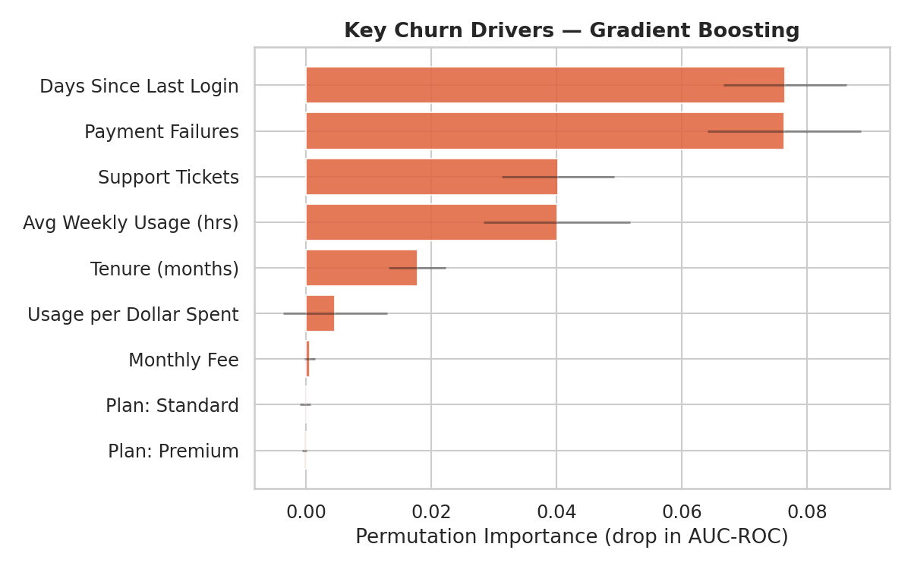
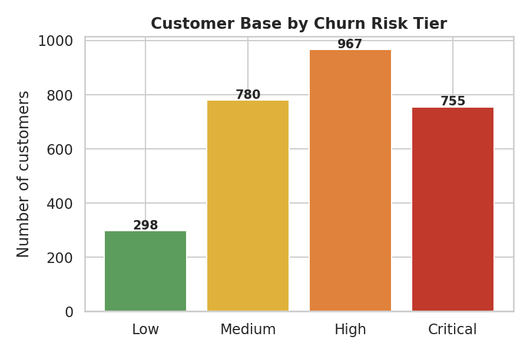

# Customer Churn Prediction for Subscription Businesses

A predictive model that identifies subscription customers at high risk of churning and pinpoints the key behavioral factors driving that churn — built end-to-end from raw data to a scored, actionable customer list.

> **Note on data:** This project uses a synthetic/practice dataset (`data/customer_subscription_churn_usage_patterns.csv`, 2,800 customers) built to demonstrate the full churn-modeling workflow, since no real production data was available. The pipeline itself is written to be data-agnostic — pointed at a real customer export, it would run unchanged.

## Results at a Glance

| Model | AUC-ROC | Avg. Precision | Recall (Churn) |
|---|---|---|---|
| Logistic Regression | 0.702 | 0.724 | 78% |
| Random Forest | 0.731 | 0.791 | 74% |
| **Gradient Boosting (best)** | **0.737** | **0.795** | 74% |

**Top churn drivers** (by permutation importance): days since last login, payment failures, support ticket volume, and average weekly usage. Plan tier and monthly fee had almost no independent effect — **churn here is driven by behavior, not price.**



27% of the customer base (755 of 2,800) falls into the "Critical" risk tier (≥75% predicted churn probability) and would be the first priority for retention outreach.



## Interactive App

A live Streamlit dashboard (`app.py`) lets you explore the scored customer base and test the model interactively:
- **Overview** — risk tier distribution, churn-by-plan, and key driver charts
- **Customer Explorer** — sortable/filterable table of all scored customers with a CSV export
- **What-If Predictor** — adjust usage, support tickets, payment failures, and tenure with sliders to see the model's predicted churn risk update live

```bash
pip install -r requirements.txt
streamlit run app.py
```

To deploy it for free and get a shareable link: push this repo to GitHub, then deploy at [share.streamlit.io](https://share.streamlit.io) pointing at `app.py` — no extra configuration needed.

## Project Structure

```
.
├── app.py                                # Interactive Streamlit dashboard
├── notebooks/
│   └── churn_prediction_analysis.ipynb   # Full narrated analysis (start here)
├── churn_pipeline.py                     # Standalone script version of the same pipeline
├── data/
│   └── customer_subscription_churn_usage_patterns.csv
├── images/                               # All charts generated by the analysis
├── outputs/
│   └── scored_customers_churn_risk.csv   # Every customer scored with churn probability + risk tier
├── requirements.txt
└── README.md
```

## How to Run

```bash
pip install -r requirements.txt

# Option A: interactive dashboard (recommended for a quick look)
streamlit run app.py

# Option B: run the notebook
jupyter notebook notebooks/churn_prediction_analysis.ipynb

# Option C: run the script directly (regenerates images/ and outputs/)
python churn_pipeline.py
```

## Approach

1. **EDA** — profiled the data, checked churn rate by segment, and compared feature distributions between churned and retained customers.
2. **Feature engineering** — derived usage-per-dollar, inactivity flags, and tenure buckets in addition to the raw fields.
3. **Modeling** — trained and compared Logistic Regression, Random Forest, and Gradient Boosting on an 80/20 stratified split.
4. **Evaluation** — AUC-ROC, average precision, and confusion matrix on a held-out test set (accuracy alone is misleading for churn, so ranking-based metrics were prioritized).
5. **Interpretation** — used permutation importance (model-agnostic) rather than relying on a single model's built-in importance, plus logistic regression coefficients to confirm direction of effect.
6. **Scoring** — applied the best model to the full customer base and segmented everyone into Low/Medium/High/Critical risk tiers with a recommended action for each.

## Key Findings

- **Inactivity is the clearest early-warning sign.** Customers who haven't logged in recently are far more likely to churn than active ones — this should be the primary trigger for proactive outreach.
- **Payment failures matter a lot.** Even a single failed payment substantially raises churn odds, likely reflecting expired cards or price sensitivity.
- **Support friction compounds risk.** Higher support-ticket volume correlates with higher churn, suggesting unresolved issues push customers out.
- **Price is not the driver.** Plan tier and monthly fee sit near zero in both importance and coefficient analysis — discounting would not be an efficient lever here.

## Limitations & Next Steps

This is a synthetic, single-snapshot dataset, so two things would meaningfully improve a real deployment:
- **Time-aware features** — modeling *trends* in usage (declining vs. stable vs. growing) rather than single point-in-time values is typically the single biggest accuracy lift available in real churn data.
- **Causal validation** — before acting on these risk scores at scale, an A/B test (intervention vs. held-out control on the same risk tier) would be needed to confirm the interventions actually reduce churn rather than just correlating with it.

## Tools Used

Python (pandas, scikit-learn, matplotlib, seaborn). Built with the assistance of Claude (Anthropic) for code generation, charting, and report drafting, with all modeling choices, metrics, and interpretation reviewed and validated manually.
